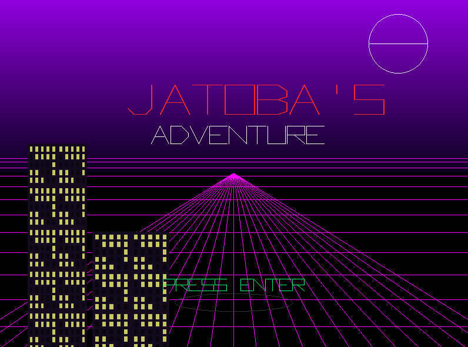

# Jatobá's Adventure

 

## 📚 Informações Acadêmicas

**Universidade Estadual do Ceará**  
**Computação Gráfica - Primeiro Trabalho**   
**Professor: Matheus Araújo** 

Vídeo-Apresentação: [- YouTube](https://www.youtube.com/watch?v=-r4CbDQ3zCI)

### 👥 Membros da Equipe

* **Eduardo Matias** 
* **Lucas Emanuel** 
* **Murilo Sousa**

---

## 🎮 Sobre o Projeto

**Jatobá's Adventure** é um jogo de ação estilo *Beat 'em Up* desenvolvido em **Python**. O objetivo principal deste projeto não é apenas criar um jogo, mas implementar manualmente, os algoritmos fundamentais da Computação Gráfica (rasterização, transformações, recorte, projeção), utilizando a biblioteca `pygame` apenas como interface de acesso ao framebuffer (canvas) e gerenciamento de janela.

O projeto apresenta um motor gráfico capaz de renderizar primitivas, polígonos texturizados, gradientes de cor e gerenciar uma câmera virtual com sistema de viewport dinâmico.

---

## ⚙️ Implementações Técnicas (Requisitos)

Abaixo detalhamos como os conceitos teóricos de Computação Gráfica foram aplicados na arquitetura do projeto.

### 1. Algoritmos de Rasterização (Primitivas)

Implementação de algoritmos para converter formas geométricas matemáticas em pixels na tela.

* **Retas (Bresenham):**
  
  * **Lógica:** Utilizamos uma variação do algoritmo de Bresenham/DDA para traçar linhas. O algoritmo calcula o diferencial (`dx`, `dy`) e incrementa pixel a pixel baseado no erro acumulado, evitando o uso intensivo de divisões de ponto flutuante.
  * **Localização:** `core/algorithms.py` -> Função `draw_line`.
  * **Aplicação:** Usado para desenhar as linhas de contorno, a grade "Cyberpunk" do menu e os vetores da fonte de texto.

* **Círculos e Elipses:**
  
  * **Lógica:** Utiliza a simetria de 4 quadrantes. Calcula-se os pontos de um arco e espelha-se para os outros quadrantes.
  * **Localização:** `core/algorithms.py` -> Função `draw_ellipse`.
  * **Aplicação:** Renderização da Lua na tela de título e sombras/poças no chão.

### 2. Preenchimento de Polígonos (Scanline)

* **Scanline Fill:**
  
  * **Lógica:** O algoritmo ordena as arestas do polígono, varre a tela linha por linha (scanlines), calcula as interseções das arestas ativas com a linha atual e preenche os pixels entre pares de interseções.
  * **Localização:** `core/rasterizer.py` -> Função `scanline_fill`.
  * **Aplicação:** Preenchimento de todas as entidades (Player, Inimigos, Chão) que não possuem textura.

* **Interpolação (Gouraud/Textura):**
  
  * **Lógica:** Durante a varredura do Scanline, interpolamos valores além da posição X. Para texturas, interpolamos coordenadas `(u, v)`. Para gradientes, interpolamos valores `(r, g, b)` entre o topo e a base do polígono.
  * **Localização:** `core/rasterizer.py` -> Funções `scanline_texture` e `scanline_fill_gradiente`.
  * **Aplicação:** Prédios texturizados, montanhas com degradê e céu da primeira fase.

### 3. Recorte (Clipping)

Para otimizar a renderização e evitar erros de desenho fora da memória de vídeo.

* **Cohen-Sutherland:**
  * **Lógica:** O espaço é dividido em 9 regiões usando códigos binários (Bitcodes: Top, Bottom, Left, Right). Linhas totalmente dentro são aceitas; totalmente fora são rejeitadas. Linhas que cruzam a borda são cortadas matematicamente na interseção com a janela de visualização.
  * **Localização:** `core/clipping.py` (Algoritmo) e `core/renderer.py` (Aplicação em `draw_primitive_line`).
  * **Aplicação:** Garante que linhas da grade ou da interface não "estourem" a tela ou causem crash.

### 4. Transformações Geométricas e Matrizes

Todo o movimento no jogo é calculado via Álgebra Linear.

* **Matrizes de Transformação:**
  * **Lógica:** Uso de Coordenadas Homogêneas (Matrizes 3x3 para 2D). As operações de **Translação**, **Rotação** e **Escala** são combinadas em uma única "Matriz Modelo" através da multiplicação de matrizes.
  * **Localização:** `math_utils/matrix.py`.
  * **Aplicação:** O método `render_entity` no `renderer.py` calcula a posição final de cada parte do corpo do personagem (braços girando, corpo movendo) multiplicando os vértices locais pela matriz combinada.

### 5. Transformação de Visualização (Window to Viewport via Matrizes)

Implementação formal do pipeline de visualização baseado em Álgebra Linear, conforme fundamentação teórica da disciplina.

* **Fundamentação Teórica ():**
* **Lógica:** Abandonamos a abordagem algébrica simples para adotar a **Composição de Matrizes**. A classe `Camera` gera uma matriz de transformação  que é o produto de três operações:
1. : Translada a janela do mundo para a origem.
2. : Aplica a escala para normalizar as dimensões (Zoom).
3. : Translada para a posição do Viewport na tela.


* **Aplicação:** Todos os vértices do jogo são multiplicados por essa matriz  antes da rasterização.
* **Localização:** `engine/camera.py` -> Método `_update_transformation_matrix`.


* **Múltiplas Viewports (Minimapa Matricial):**
* **Lógica:** Para demonstrar a robustez do sistema, o **Minimapa** não é um desenho estático, mas sim o resultado de uma **segunda instância da classe Camera** (`mini_camera`).
* **Funcionamento:** Enquanto a câmera principal mapeia uma pequena janela móvel para a tela cheia, a câmera do minimapa mapeia **todo o nível (0 a 4000px)** para um **pequeno viewport (250x40px)**.
* **Resultado:** O jogador desenhado no minimapa é a renderização dos mesmos vetores do jogo original, porém submetidos a uma matriz de escala severa, provando que o motor vetorial mantém a consistência geométrica em qualquer resolução.


### 6. Máquina de Estados e Loop de Jogo
Gerenciamento do fluxo da aplicação.

* **Game Loop & Pause:**
  
  * **Lógica:** O loop principal desacopla a atualização lógica (`update`) da renderização (`draw`). Isso permitiu a implementação do sistema de **Pause**, onde o jogo para de atualizar a física (`dt` não é processado), mas continua desenhando a cena congelada com um overlay semitransparente.
  * **Localização:** `main.py` (Estrutura `while running`).

---

## 📂 Estrutura do Projeto

```text
+-- assets
|   +-- textures          # Imagens png usadas para texturização
+-- core                  # O "Coração" Gráfico (Algoritmos puros)
|   +-- algorithms.py     # Bresenham, Elipses, Flood Fill
|   +-- clipping.py       # Cohen-Sutherland
|   +-- rasterizer.py     # Scanline Fill, Texturização, Gradientes
|   +-- renderer.py       # Gerenciador de render e pipeline
|   +-- vertice.py        # Estrutura de dados de Vértice (x, y, u, v)
+-- engine                # Motor do Jogo
|   +-- assets_loader.py  # Carregamento seguro de imagens
|   +-- camera.py         # Lógica de Window-to-Viewport
|   +-- input.py          # Gerenciamento de Teclado/Mouse
+-- game                  # Lógica de Gameplay
|   +-- entities          # Classes do Player e Inimigos
|   +-- levels.py         # Geração procedural de fases
|   +-- highscore.py      # Persistência de dados (JSON)
|   +-- title.py          # Tela de título vetorial
+-- math_utils            # Biblioteca Matemática
|   +-- matrix.py         # Operações Matriciais 3x3
|   +-- vector.py         # Operações Vetoriais
+-- main.py               # Ponto de entrada e Game Loop
+-- scores.json           # Banco de dados local de pontuação
```

---

## 🚀 Como Executar

### Pré-requisitos

* Python 3.x instalado.
* Biblioteca `pygame`.

### Instalação

1. Clone o repositório ou extraia os arquivos.

2. Instale as dependências:
   
   ```bash
   pip install pygame numpy
   ```

```
3. Execute o jogo:
```bash
python main.py
```

---

## 🕹️ Controles

| Tecla          | Ação                  |
| -------------- | --------------------- |
| **W, A, S, D** | Mover o personagem    |
| **Espaço**     | Atacar                |
| **Esc**        | Pausar o Jogo         |
| **Q**          | Sair para o Menu      |
| **Enter**      | Confirmar / Continuar |
| **Mouse**      | Selecionar opções     |
| **Z / X**      | Zoom In / Zoom Out    |

---

## 🌟 Gameplay

* **3 Fases Distintas:** Estrada (Anoitecer), Estação de Trem (Interior) e Cidade (Amanhecer).
* **Sistema de Combate:** Hitboxes, invencibilidade temporária, checkpoint e +1 vida cada vez que passa de fase e animações procedurais.
* **Inimigos Variados:** Robôs, Punks e Bosses com comportamentos distintos.
* **Sistema de Score:** Multiplicador de pontos baseado na dificuldade escolhida.
* **Highscores:** Tabela de líderes persistente (salva em arquivo JSON).